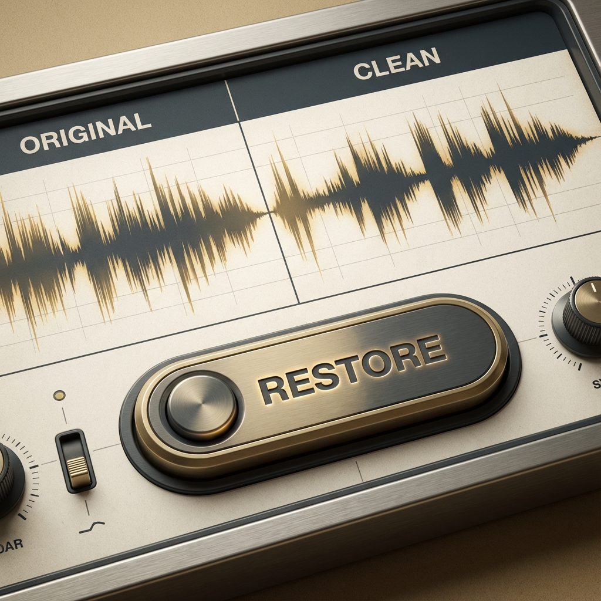

# Audio Restore


This is a small project that uses a U-Net to isolate and remove historical surface noise from 78 RPM records.



### The Problem
If you listen to a record from the 1920s, there's usually a constant hiss or crackle in the background. Most standard digital filters end up stripping away the actual music along with the noise.

### The Fix
I treated the restoration as an image-to-image translation task:
1. **Audio to Spectrogram**: I convert the sound into a visual heatmap of frequencies.
2. **U-Net**: A neural network trained to look at a noisy spectrogram and predict the clean version beneath it.
3. **Reconstruction**: The "cleaned" image is turned back into a playable audio file.

It's not a perfect studio remaster, but it does a surprisingly good job of bringing out audio that's been buried under 100 years of dust.

### Setup

**1. Install**
```bash
pip install -r requirements.txt
```

**2. Get Data**
This pulls a sample pair (noisy vs restored) from the Internet Archive.
```bash
python src/fetch.py
```

**3. Train**
```bash
python src/model.py
```

**4. Run App**
```bash
streamlit run app.py


```


### Tech
- **PyTorch**: Model architecture.
- **Librosa**: Signal processing.
- **Streamlit**: UI for the dashboard.

Data is sourced from the [Great 78 Project](https://great78.archive.org/).
